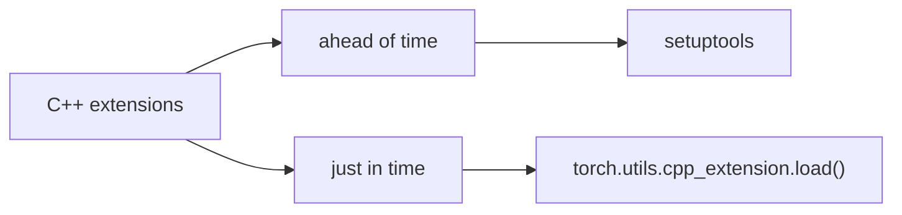

# Accelerate pytorch with cuda and c++

## General use case

1. lots of sequential computation

   ```
   x = f1(x)
   
   x = f2(x)
   
   ...
   
   x = fn(x)
   ```

2. non-parallel computation

   e.g. For each batch, do an operation that depends on the data length (e.g. volume rendering)

## How it work


Combine together all the C++ and CUDA files we'll need and use PyBind11 to build the interface we want; 

Fortunately, [PyBind11](https://github.com/pybind/pybind11) is included with Pytorch.

## Example: Trilinear interpolation

### writing a C++ Extension

C++ extensions come in two flavors: They can be built “ahead of time” with `setuptools`, or “just in time” via `torch.utils.cpp_extension.load()`. We’ll begin with the first approach and discuss the latter later.



#### Building with `setuptools`

For the “ahead of time” flavor, we build our C++ extension by writing a `setup.py` script that uses `setuptools` to compile our C++ code. 


## Acknowledgement

Thanks for all the contributors below!

Pytorch official tutorial: https://pytorch.org/tutorials/advanced/cpp_extension.html

kwea123's tutorial: [YouTube](https://www.youtube.com/watch?v=l_Rpk6CRJYI&list=PLDV2CyUo4q-LKuiNltBqCKdO9GH4SS_ec) and [repo](https://github.com/kwea123/pytorch-cppcuda-tutorial)

PyBind11: https://github.com/pybind/pybind11

Example pybind11 module built with a CMake-based build system: https://github.com/pybind/cmake_example

Examples for the usage of "pybind11": https://github.com/tdegeus/pybind11_examples
