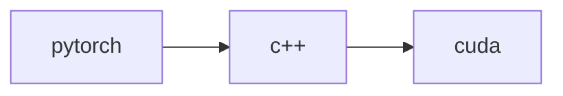

# Accelerate pytorch with cuda and c++

## General use case

1. 串行计算 lots of sequential computation

   such as

   x = f1(x)

   x = f2(x)

   ...

   x = fn(x)

2. 非并行计算 non parallel computation

   such as

   For each batch, do an operation that depends on the data length (e.g. volume rendering)

## How it work

## Example: Trilinear interpolation
