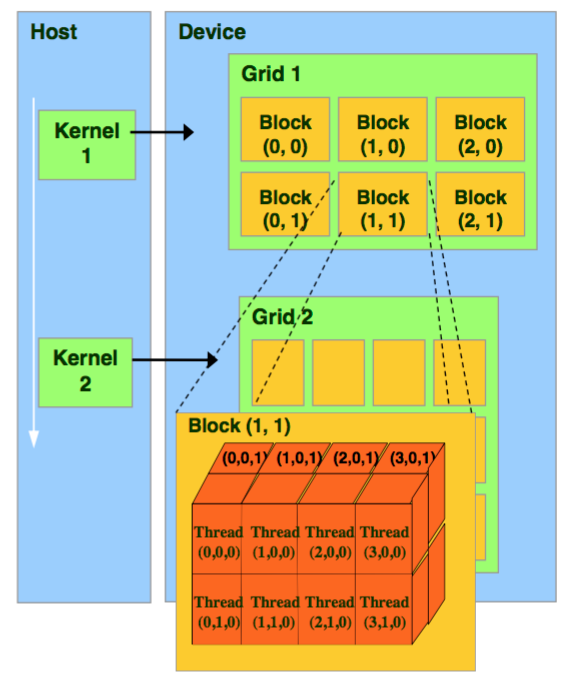
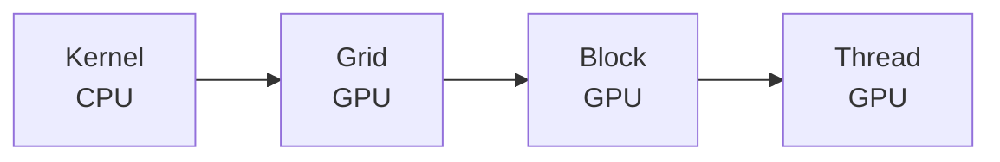
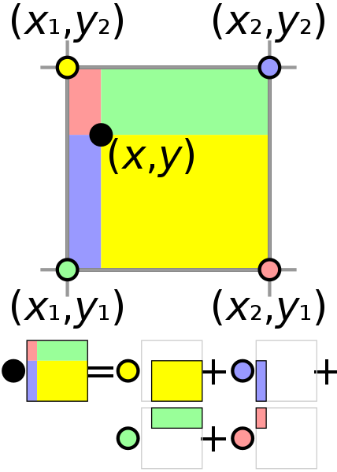
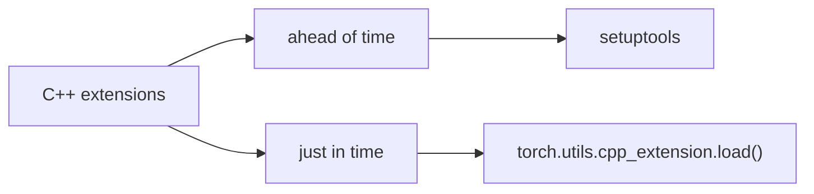

# Accelerate pytorch with cuda and c++

## General use case

1. lots of sequential computation

   ```
   x = f1(x)
   
   x = f2(x)
   
   ...
   
   x = fn(x)
   ```

2. non-parallel computation

   e.g. For each batch, do an operation that depends on the data length (e.g. volume rendering)

## How it work


Combine together all the C++ and CUDA files we'll need and use PyBind11 to build the interface we want; 

Fortunately, [PyBind11](https://github.com/pybind/pybind11) is included with Pytorch.





## Example: Trilinear interpolation

### Bilinear interpolation



Suppose that we want to find the value of the unknown function *f* at the point (*x*, *y*). It is assumed that we know the value of *f* at the four points $$Q_{11} = (x_1, y_1), Q_{12} = (x_1, y_2), Q_{21} = (x_2, y_1), Q_{22} = (x_2, y_2)$$.

### Writing a C++ Extension

C++ extensions come in two flavors: They can be built “ahead of time” with `setuptools`, or “just in time” via `torch.utils.cpp_extension.load()`. We’ll begin with the first approach and discuss the latter later.



### Building with `setuptools`

For the “ahead of time” flavor, we build our C++ extension by writing a `setup.py` script that uses `setuptools` to compile our C++ code. 

[setup.py](./setup.py)

```python
from setuptools import setup
from torch.utils.cpp_extension import CppExtension, BuildExtension

setup(
       name='cppcuda_tutorial',
       version='1.0',
       author='wenboji',
       author_email='wenboji0420@gmail.com',
       description='cppcuda example',
       long_description='example of accelerating pytorch with cppcuda',
       ext_modules=[
           CppExtension(
               name='cppcuda_tutorial',
               sources=['interpolation.cpp']
            )
        ],
       cmdclass={
           'build_ext':BuildExtension
        }
    )
```

`CppExtension` is a convenience wrapper around `setuptools.Extension` that passes the correct include paths and sets the language of the extension to C++. 

`BuildExtension` performs a number of required configuration steps and checks and also manages mixed compilation in the case of mixed C++/CUDA extensions. And that’s all we really need to know about building C++ extensions for now! 

Let’s now take a look at the implementation of our C++ extension, which goes into `interpolation.cpp`.

```python
import glob
import os.path as osp
from setuptools import setup
from torch.utils.cpp_extension import CUDAExtension, BuildExtension

ROOT_DIR = osp.dirname(osp.abspath(__file__))
include_dirs = [osp.join(ROOT_DIR), "include"]

sources = glob.glob('*.cpp')+glob.glob('*.cu') # find all files


setup(
       name='cppcuda_tutorial',
       version='1.0',
       author='wenboji',
       author_email='wenboji0420@gmail.com',
       description='cppcuda example',
       long_description='example of accelerating pytorch with cppcuda',
       ext_modules=[
           CUDAExtension(
               name='cppcuda_tutorial',
               sources=sources,
               include_dirs=include_dirs,
               extra_compile_args={'cxx':['-02'],
                                    'nvcc':['-02']} # accelerate the compilation
            )
        ],
       cmdclass={
           'build_ext':BuildExtension
        }
    )
```

### Writing the C++ Op

[interpolation.cpp](./interpolation.cpp)

```c++
#include <torch/extension.h>
#include "utils.h"

torch::Tensor trilinear_interpolation(
		torch::Tensor feats,
		torch::Tensor points){
	CHECK_INPUT(feats);
	CHECK_INPUT(points);
	return trilinear_fw_cu(feats, points);
}

// input:
// 	feats: (N, 8, F)
// 	point: (N, 3)
// output:
// 	feat_interp: (N, F)
// tip: N and F can be computed parallel

PYBIND11_MODULE(TORCH_EXTENSION_NAME, m){
	m.def("trilinear_interpolation", &trilinear_interpolation, R"pbdoc(
		m.def("name_in_python",&name_in_cpp)
		)pbdoc");
}

```

`<torch/extension.h>` is the one-stop header to include all the necessary PyTorch bits to write C++ extensions. It includes:

- The ATen library, which is our primary API for tensor computation,
- [pybind11](https://github.com/pybind/pybind11), which is how we create Python bindings for our C++ code,
- Headers that manage the details of interaction between ATen and pybind11.

### Writing a utils.h

```c++
#include <torch/extension.h>
// judge input is or isn't Tensor and contiguous
#define CHECK_CUDA(x) TORCH_CHECK(x.is_cuda(), #x "must be a CUDA tensor")

#define CHECK_CONTIGUOUS(x) TORCH_CHECK(x.is_contiguous(), #x "must be contiguous")

#define CHECK_INPUT(x) CHECK_CUDA(x); CHECK_CONTIGUOUS(x)

torch::Tensor trilinear_fw_cu(
	torch::Tensor feats,
	torch::Tensor points	
);
```

### Writing a CUDA Extension

```c
#include <torch/extension.h>

torch::Tensor trilinear_fw_cu( //fw means forward
	torch::Tensor feats,
	torch::Tensor points	
){
	const int N = feats.size(0), F = feats.size(2);
	torch::Tensor feat_interp = torch::zeros({N, F}, feats.options()); // cpp form
	// python form:
	// feat_interp = torch.zeros(N, F, dtype=torch.float32, device='cuda:1')
	// what if we want to define a variable which have different dtype with input, 
	//such as integer, with cpp:
	// torch::Tensor feat_interp = torch::zeros({N, F}, torch::dtype(torch::kInt32).device(feats.device()))
	const dim3 threads(16, 16); // define size of thread
	const dim3 blocks((N+threads.x-1)/threads.x,
			(F+threads.y-1)/threads.y); //define size of block
	// launch kernel
	// AT_DISPATCH_FLOATING_TYPES -> float 32, float64
	// AT_DISPATCH_FLOATING_TYPES_AND_HALF -> float 32, float 64, float16
	// AT_DISPATCH_INTEGRAL_TYPES -> integral

	AT_DISPATCH_FLOATING_TYPES(feats.type(), "trilinear_fw_cu",([&] {
		trilinear_fw_kernel<scalar_t><<<blocks, threads>>>(
	feats.packed_accessor<scalar_t, 3, torch::RestrictPtrTraits, size_t>(),
	points.packed_accessor<scalar_t, 2, torch::RestrictPtrTraits, size_t>(),
	feat_interp.packed_accessor<scalar_t, 2, torch::RestrictPtrTraits, size_t>()
	);
	}));
}
```

### Binding to Python

Once you have your operation written in C++ and ATen, you can use pybind11 to bind your C++ functions or classes into Python in a very simple manner. Questions or issues you have about this part of PyTorch C++ extensions will largely be addressed by [pybind11 documentation](https://pybind11.readthedocs.io/en/stable/).

For our extensions, the necessary binding code spans only four lines:

```c++
PYBIND11_MODULE(TORCH_EXTENSION_NAME, m){
	m.def("trilinear_interpolation", &trilinear_interpolation, R"pbdoc(
		m.def("name_in_python",&name_in_cpp)
		)pbdoc");
}
```

One bit to note here is the macro `TORCH_EXTENSION_NAME`. The torch extension build will define it as the name you give your extension in the `setup.py` script. In this case, the value of `TORCH_EXTENSION_NAME` would be “interpolation_cpp”. This is to avoid having to maintain the name of the extension in two places (the build script and your C++ code), as a mismatch between the two can lead to nasty and hard to track issues.

### Using Your Extension

Put the `interpolation.cpp` and `setup.py` under same dir. Then run `python setup.py install ./`  to build and install your extension. 

Once your extension is built, you can simply import it in Python, using the name you specified in your `setup.py` script. Just be sure to `import torch` first, as this will resolve some symbols that the dynamic linker must see:

[test.py](./test.py)

```python
import torch
import cppcuda_tutorial # import your installed c++ extension
import time

def trilinear_interpolation_py(feats, points):
    feats = torch.ones(2)
    point = torch.zeros(2)

if __name__ == '__main__':
    feats = torch.ones(2, device='cuda')
    points = torch.zeros(2, device='cuda')

    out = cppcuda_tutorial.trilinear_interpolation(feats, points)

    print(out)
```

Now we test if the extension can run correctly.

run `python test.py`. This should look something like this:

```python
tensor([1., 1.])
```

That means pytorch call the c++ extension correctly.

### How to compute size of block

If we have a Tensor which size is 20\*10, and we set Thread's size is 16\*16. 


Obviously, we can't cover this Tensor with just one Thread. So we need to add another Thread to fit this Tensor. 


Finally, the size of Block should be 2*1, that contain two Threads in a row.

## Acknowledgement

Thanks for all the contributors below!

Pytorch Official Tutorial: https://pytorch.org/tutorials/advanced/cpp_extension.html

Pytorch C++ API: https://pytorch.org/cppdocs/

Custom C++ and CUDA Extensions: https://pytorch.org/tutorials/advanced/cpp_extension.html

NYU's lesson: [Introduction to GPUs](https://nyu-cds.github.io/python-gpu/)

kwea123's tutorial: [YouTube](https://www.youtube.com/watch?v=l_Rpk6CRJYI&list=PLDV2CyUo4q-LKuiNltBqCKdO9GH4SS_ec) and [repo](https://github.com/kwea123/pytorch-cppcuda-tutorial)

PyBind11: https://github.com/pybind/pybind11

Example pybind11 module built with a CMake-based build system: https://github.com/pybind/cmake_example

Examples for the usage of "pybind11": https://github.com/tdegeus/pybind11_examples
